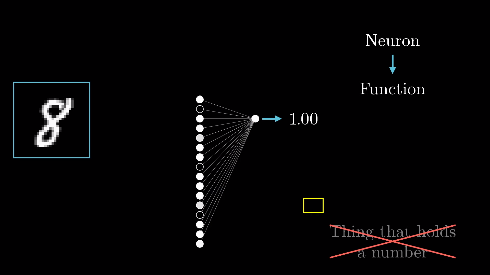
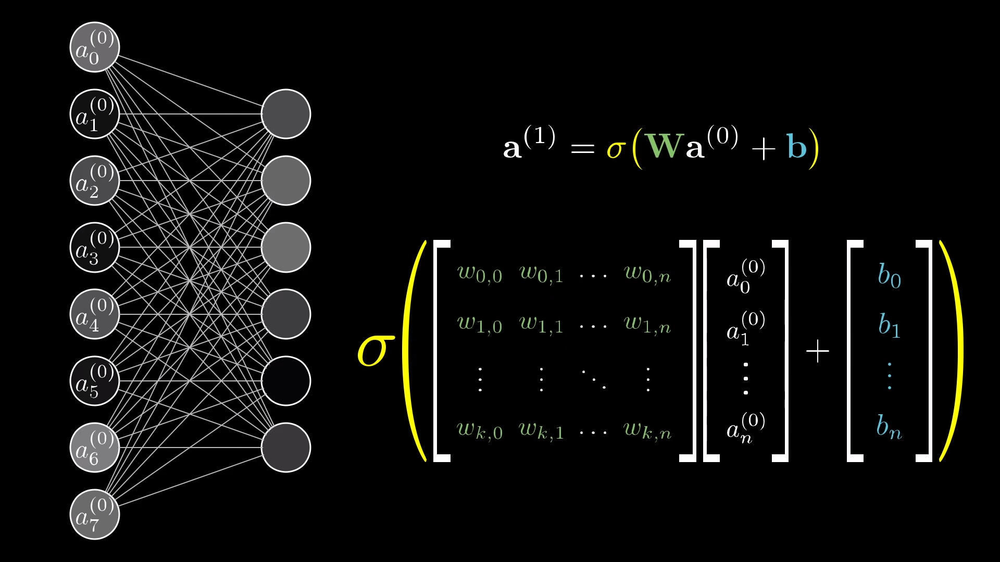

# Neural networks
[Introduction video - **But what is a Neural Network?**](https://www.youtube.com/watch?v=aircAruvnKk)

Before explaning the concepts and details about **what is a neural network**, is important to understand that  multiple variations of neural networks exist, they are designed for better achieve some desired behavior/result such as classify images, generate text and other tasks. This introduction refer to the "vanila" neural network _(also known as [multilayer perceptron](https://en.wikipedia.org/wiki/Multilayer_perceptron#:~:text=A%20multilayer%20perceptron%20(MLP)%20is,activation%3B%20see%20%C2%A7%20Terminology.))_ that paved the way for more advanced ones. A neural network is structure **loosely** based on the human brain, this means that a group of **neurons**  when "correctly" stimulated can fire transmiting **information** between themselves to generate some output/result.

In the neural network context a **neuron** can be understood as a function _(and visualized as **node** in a graph)_ that **receives multiple numerical inputs** and **outputs a numeric value** usually between 0 and 1.

Understanding a neural network as a **big function** composed of **neuron functions** that are **connect** between themselves with a **variable numeric weight** _(that can be adjusted)_ to generate a desired output **vector of numeric** values is a good starting point.

Let`s break down the details of this big function function that we call **neural network**. The neural network contain a structure with **layred neurons**, the neural net can have 3 or more layers compose of:

**input layer:** here are the numerical values passed as the input arguments for our _"function" (neural network)_, those are numerical values such as RGB pixels for images or other numerical representations such as the price of a stock in a given day.

**hidden layer**: here is were the magic happens, the amount of hidden layers and the amount of neurons in each layer is arbitrary, usually is a value empirically defined, broadly larger neural networks are harder to optimize due to more parameters, but to few layers/neurons can cap how good the results can be. The hidden layers purpose is try to capture the "meaning" and relevance in the many examples provided as in the input layer, in a image context those can be edges, sharpness and a host of features that makes makes many detector neurons for each pattern.

**output layer**: This layer provides the desired result, this layer can have a arbitrary number of outputs, if you want to classify if a image is a dog, rabbit or a cat your neural network will have 3 output neurons that will have a value denoting how confident the guess for each animal is.

some of the equatios that define the weight of connections between neurons and the result can be seen in the images below.

The [sigmoid function](https://youtu.be/aircAruvnKk?t=1035) and [also others](https://machinelearningmastery.com/rectified-linear-activation-function-for-deep-learning-neural-networks/#:~:text=The%20rectified%20linear%20activation%20function,otherwise%2C%20it%20will%20output%20zero.) is what makes the range of values as mentioned before restricted on the range 0 to 1, constraining this value can have a special meaning of **how much a neuron is activated**, a value of 1 would mean a fully activated neuron, as such a value of zero is a inactive neuron, such values are propagated to the next neurons on the chain until the output layer is reached.

Defining the weights that connect each neuron is another mather, algorithms such as backpropagation are applied to try and find a optimal value for those weights, making the neural network produce more desirable numeric outputs.

_**Next: [Neural network - some math definitions](2-some-math-definitions.md)**_
