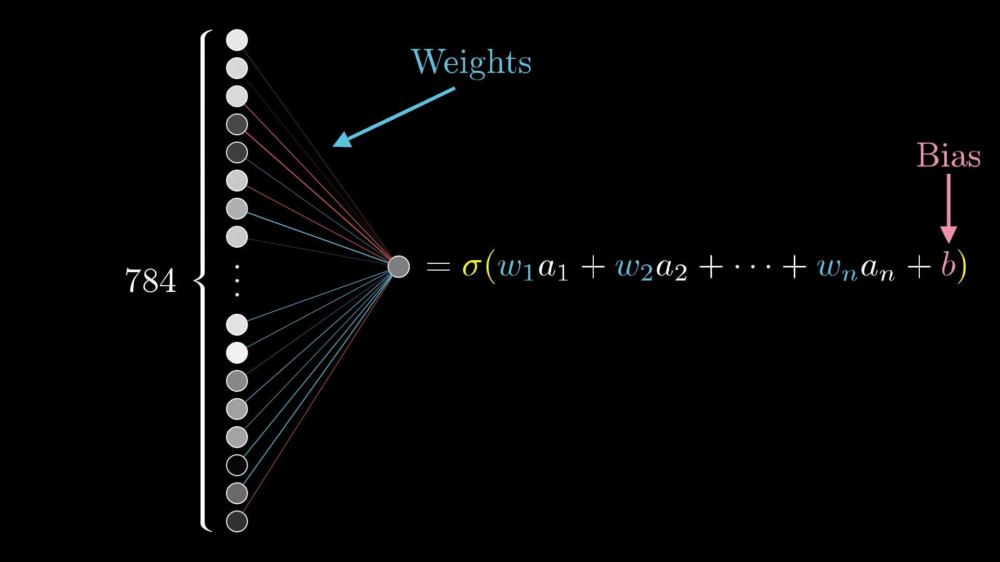
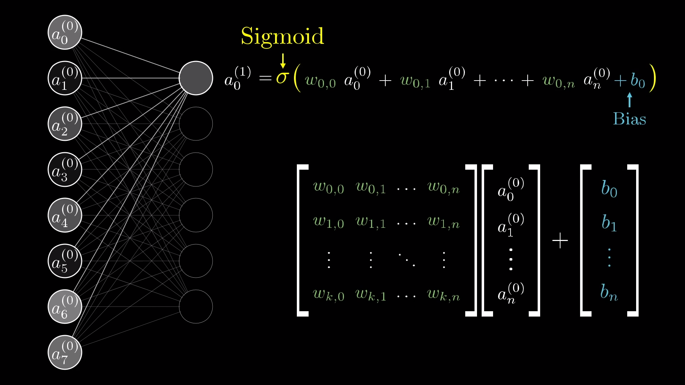

# Some math definitions
In the previous article we defined general concepts to think about what is a neural network and its structure, now lets unpack some of math details slowly to better understand how it works internally.

## The math behind the neuron 
The neuron as seen before, is one of the main concepts used to describe a neural network, since its so vital in our mental model lets understand how to derive its value. The value for each neuron _( except in the input layer )_ is based on the **connection with all neurons in the previous layer**(in the immediately previus layer only), the **connection** is also called **weight**.

The math behind the whole neural network might look daunting, with matrix multiplication and sum, but all that we have to calculate is the value for all the neurons in the neural network, we can breakdown this problem on **how to calculate a single neuron**.

Understanding what each value in the equation to calculate the **first neuron** for the **first hidden layer** might help us unpack the complete neural net.
A more formal description for the first neuron in the hidden layer is:

