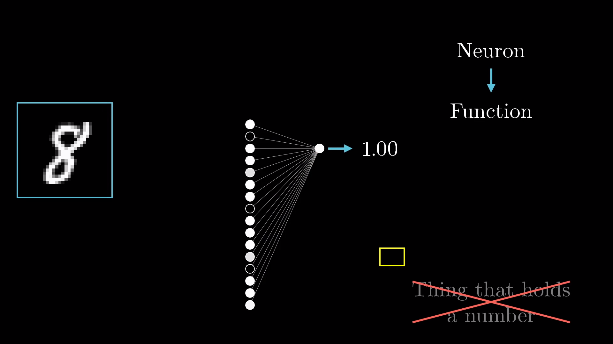
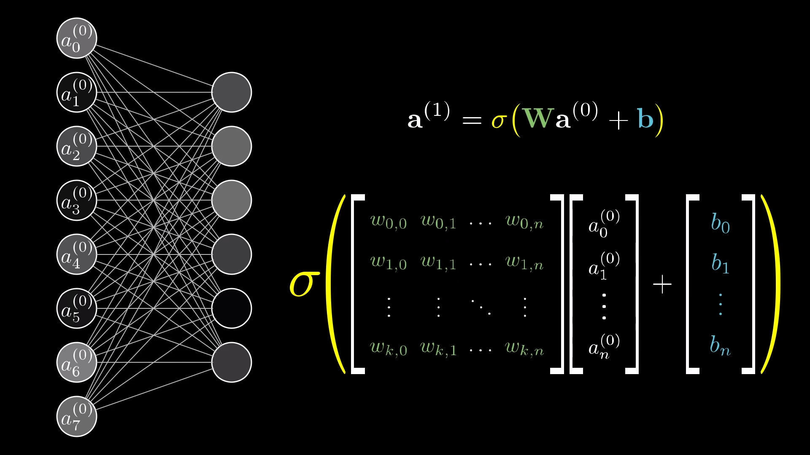
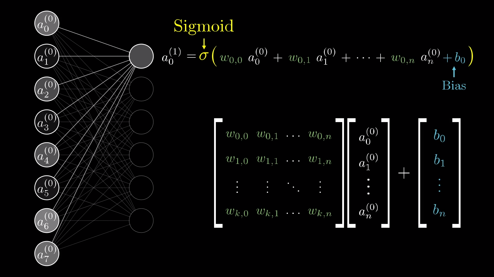

# Pytorch AI Learning
This repository is my personal guide used to learn AI using [pytorch](https://pytorch.org/), some other python libraries are also mixed in as a way consolidate different concepts. This learning journey assumes programming experience, not so much with advanced python, but programming concepts in general _( object oriented programming, data structures and other fundamentals )_.

_This material was inspired by [**3Blue1Brown**](https://www.youtube.com/channel/UCYO_jab_esuFRV4b17AJtAw) amazing explanations + visualization and also [**Sentdex**](https://www.youtube.com/user/sentdex) for some of the best hands on content about AI with python._

# Neural networks
[Introduction video - **But what is a Neural Network?**](https://www.youtube.com/watch?v=aircAruvnKk)

Before explaning the concepts and details about **what is a neural network**, is important to understand that  multiple variations of neural networks exist, they are designed for better achieve some desired behavior/result such as classify images, generate text and other tasks. This introduction refer to the "vanila" neural network _(also known as [multilayer perceptron](https://en.wikipedia.org/wiki/Multilayer_perceptron#:~:text=A%20multilayer%20perceptron%20(MLP)%20is,activation%3B%20see%20%C2%A7%20Terminology.))_ that paved the way for more advanced ones. A neural network is structure **loosely** based on the human brain. This means a group of **neurons**  when "correctly" stimulated can fire transmiting **information** between themselves to generate some output/result.

In the neural network context a neuron can be understood as a function that **receives multiple numerical inputs** and **outputs a numeric value** usually between 0 and 1.

Understanding a neural network as **big function** composed of **neuron functions** that are **connect** between themselves with a **variable numeric weight** _(that can be adjusted)_ to generate a desired output **vector of numeric** values is a good starting point; some of the equatios that define the weight of connections between neurons and the result can be seen in the images below.

The [sigmoid function](https://en.wikipedia.org/wiki/Sigmoid_function) and [also others](https://machinelearningmastery.com/rectified-linear-activation-function-for-deep-learning-neural-networks/#:~:text=The%20rectified%20linear%20activation%20function,otherwise%2C%20it%20will%20output%20zero.) is what makes the range of values as mentioned before restricted on the range 0 to 1, constraining this value can have a special meaning of **how much a neuron is activated**, a value of 1 would mean a fully activated neuron, as such a value of zero is a inactive neuron, such values are propagated to the next neurons on the chain until the output layer is reached.

Defining the weights that connect each neuron is another mather, algorithms such as backpropagation are applied to try and find a optimal value for those weights, making the neural network produce more desirable numeric outputs.
